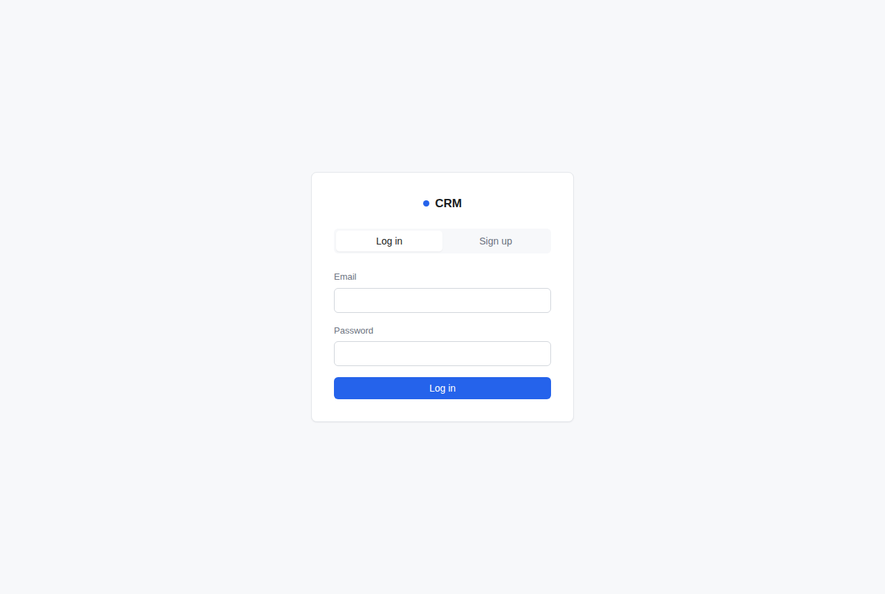
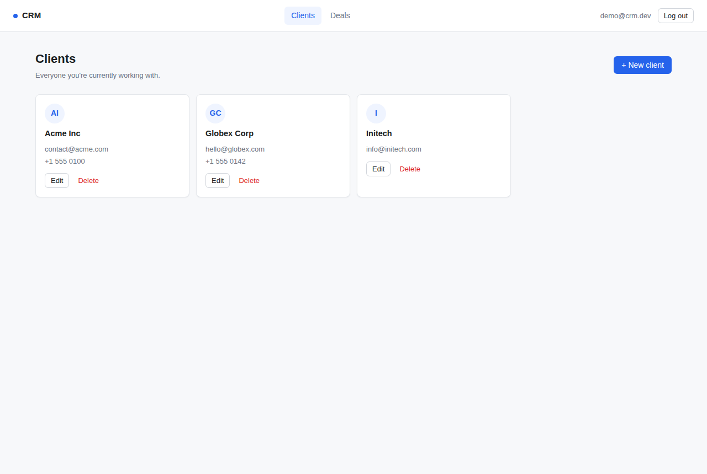
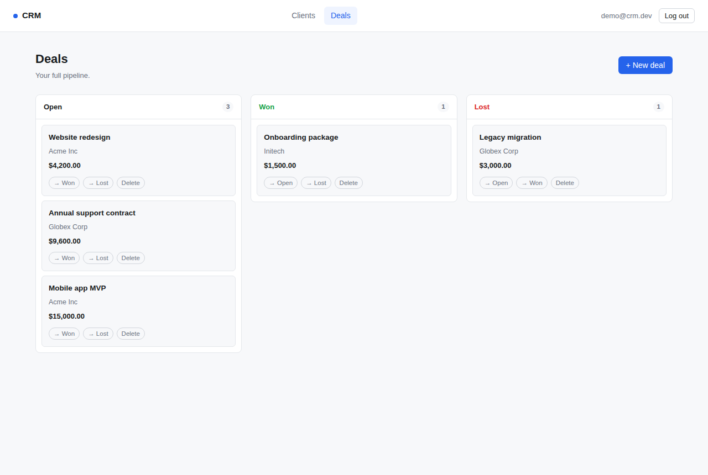
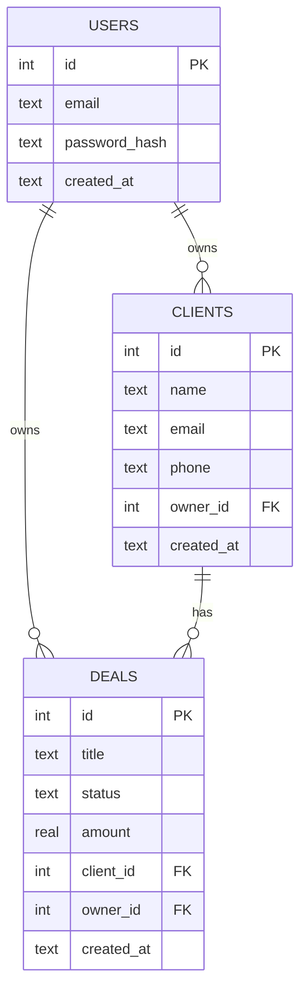

# CRM

A minimal CRM for managing clients and deals: an Express + SQLite REST API with JWT authentication, paired with a vanilla JS/HTML/CSS frontend (login/signup, a clients directory, and a Kanban-style deals pipeline).

Originally started as a todo-list app, migrated to a CRM data model (`users` → `clients` → `deals`).

## Screenshots

| Login / sign-up | Clients | Deals (Kanban) |
|---|---|---|
|  |  |  |

## Features

- Email/password authentication with JWT (register, login)
- Every client and deal is scoped to the manager who owns it (`owner_id`) — one manager never sees another manager's data
- Clients: create, list, view, edit, delete (delete is blocked while the client still has deals)
- Deals: create, list (optionally filtered by client), edit, delete, move between pipeline stages (`open` / `won` / `lost`)
- Frontend: auth screen (login + signup tabs), a clients directory, and a Kanban board for deals
- Persistent storage via SQLite (file-based, no external DB server)
- Security headers via Helmet, request logging via Morgan
- General API rate limiting, plus a dedicated stricter limiter on `/auth/login` to slow down password brute-forcing
- Centralized error handling and a `404` handler for unknown routes
- Graceful shutdown on `SIGINT`/`SIGTERM` (closes the HTTP server and the database connection)
- Frontend served directly by the backend (single origin, no CORS setup needed in development)

## Tech stack

| Layer | Technology |
|---|---|
| Runtime | Node.js (ES modules) |
| Web framework | Express |
| Database | better-sqlite3 (SQLite) |
| Auth | jsonwebtoken + bcryptjs |
| Security headers | Helmet |
| Logging | Morgan |
| Rate limiting | express-rate-limit |
| CORS | cors |
| Env config | dotenv |
| Frontend | HTML, CSS, vanilla JavaScript (ES modules) |

## Data model

| Table | Key fields | Notes |
|---|---|---|
| `users` | `id`, `email` (unique), `password_hash`, `created_at` | One row per manager |
| `clients` | `id`, `owner_id` → `users.id`, `name`, `email`, `phone`, `created_at` | Owned by exactly one manager |
| `deals` | `id`, `owner_id` → `users.id`, `client_id` → `clients.id`, `title`, `status` (`open`/`won`/`lost`), `amount`, `created_at` | A deal always belongs to a client and a manager |

Every read/write query on `clients` and `deals` filters by `owner_id = req.user.id` (from the JWT, via `middleware/auth.js`) — not just on the frontend, but on every `SELECT`/`UPDATE`/`DELETE` in the routes.



## Getting started

### Prerequisites

- Node.js 20+ and npm

### Clone

```bash
git clone https://github.com/anatolilavra-droid/CRM.git
cd CRM
```

### Install

```bash
cd backend
npm install
```

### Environment setup

```bash
cp .env.example .env
```

Set `JWT_SECRET` to a long random value (e.g. `openssl rand -base64 32`) before running anywhere beyond your own machine — tokens signed with a weak or default secret can be forged.

### Initialize the database

`users`, `clients`, and `deals` tables (plus indexes) are created by:

```bash
npm run db:init
```

### Run in development

```bash
npm run dev
```

Uses `node --watch` to restart the server automatically on file changes.

### Run in production

```bash
npm start
```

Open `http://localhost:3000` — the backend serves the frontend directly from the `frontend/` directory.

## Environment variables

All variables live in `backend/.env` (see `backend/.env.example`).

| Name | Description | Default |
|---|---|---|
| `PORT` | Port the Express server listens on | `3000` |
| `NODE_ENV` | Runtime environment; switches Morgan's log format between `dev` and `combined` | `development` |
| `JWT_SECRET` | Secret used to sign and verify JWTs | *(none — must be set manually)* |

## API reference

Base URL: `http://localhost:3000`

### `GET /health`

Health check. **Response `200`:** `{ "status": "ok" }`

### `POST /auth/register`

**Body:** `{ "email": "a@b.com", "password": "at least 8 chars" }`

**Response `201`:** `{ "token": "...", "user": { "id": 1, "email": "a@b.com" } }`

**Errors:** `400` invalid input · `409` email already registered

### `POST /auth/login`

**Body:** `{ "email": "a@b.com", "password": "..." }`

**Response `200`:** `{ "token": "...", "user": { "id": 1, "email": "a@b.com" } }`

**Errors:** `400` invalid input · `401` invalid credentials · `429` too many attempts (rate-limited: 10 requests / 15 min per IP, only failed attempts count)

All routes below require `Authorization: Bearer <token>` and only ever return/modify rows owned by the authenticated user.

### `GET /clients`

List the authenticated manager's clients.

### `GET /clients/:id`

Get one client. **Errors:** `404` if it doesn't exist or belongs to another manager.

### `POST /clients`

**Body:** `{ "name": "Acme Inc", "email": "contact@acme.com", "phone": "+1..." }` (`name` required, `email`/`phone` optional)

### `PATCH /clients/:id`

Partial update — same fields as `POST`, all optional.

### `DELETE /clients/:id`

**Response:** `204`. **Errors:** `409` if the client still has deals.

### `GET /deals`

List the authenticated manager's deals. Optional query param `client_id` filters to one client's deals.

### `GET /deals/:id`

Get one deal. **Errors:** `404` if it doesn't exist or belongs to another manager.

### `POST /deals`

**Body:** `{ "client_id": 1, "title": "Website redesign", "status": "open", "amount": 1500 }` (`client_id` and `title` required; `status` defaults to `open`; `client_id` must reference a client owned by the same manager)

### `PATCH /deals/:id`

Partial update — `title`, `status` (`open`/`won`/`lost`), `amount`.

### `DELETE /deals/:id`

**Response:** `204`.

> General API routes are rate-limited to 100 requests per 15 minutes per client; `/auth/login` has its own stricter limit (see above).

## Frontend

| Page | Purpose |
|---|---|
| `index.html` | Login / sign-up (tabs), redirects to `clients.html` on success |
| `clients.html` | Client directory — create, edit, delete, jump to a client's deals |
| `deals.html` | Kanban board (Open / Won / Lost) — create deals, move between columns, optionally filtered by `?client_id=` |
| `api.js` | Shared fetch wrapper: attaches the JWT, redirects to login on `401`, toast notifications for errors |

The JWT and logged-in user are kept in `localStorage`; `requireAuth()` guards `clients.html`/`deals.html` and redirects to `index.html` if there's no token.

## Project structure

```
.
├── frontend/
│   ├── index.html           # Auth (login/signup)
│   ├── clients.html
│   ├── deals.html
│   ├── api.js                # Shared fetch wrapper + auth guard
│   ├── auth.js
│   ├── clients.js
│   ├── deals.js
│   └── styles.css
├── backend/
│   ├── index.js               # App entry point: middleware, routes, graceful shutdown
│   ├── package.json
│   ├── .env.example
│   ├── middleware/
│   │   ├── auth.js            # JWT verification, sets req.user
│   │   └── errorHandler.js    # Centralized 404 and error handlers
│   ├── routes/
│   │   ├── auth.js            # /auth/register, /auth/login (+ login rate limiter)
│   │   ├── clients.js         # /clients CRUD, owner-scoped
│   │   └── deals.js           # /deals CRUD, owner-scoped
│   └── db/
│       ├── database.js        # better-sqlite3 connection
│       ├── init.js            # Creates users/clients/deals tables + indexes
│       └── data.db            # SQLite database file (gitignored)
└── README.md
```

## Known limitations / roadmap

These are known trade-offs made to keep this a learning-sized project, not blockers for local use:

- JWT is stored in `localStorage`, which is vulnerable to XSS. A production deployment should move to an httpOnly cookie.
- No token revocation — a token is valid for its full lifetime (7 days); logout only clears it client-side.
- No automated tests or CI yet.
- `GET /clients` and `GET /deals` return the full list with no pagination.
- SQLite is fine for a single-instance learning project; a real multi-user deployment would move to Postgres.

## Deployment

1. Provision a Node.js runtime on your target host.
2. Copy the repository, run `npm install` inside `backend/`.
3. Set environment variables (`PORT`, `NODE_ENV=production`, `JWT_SECRET`) via your platform's secret/config mechanism — do not commit `.env`.
4. Run `npm start` from `backend/`, or point your process manager at `node backend/index.js`.
5. The SQLite file (`backend/db/data.db`) is created on disk next to the code; ensure the deployment target has a persistent, writable volume for it.
6. Put the app behind a reverse proxy (e.g. Nginx) or your platform's load balancer for TLS termination.

## License

ISC (per `backend/package.json`).
